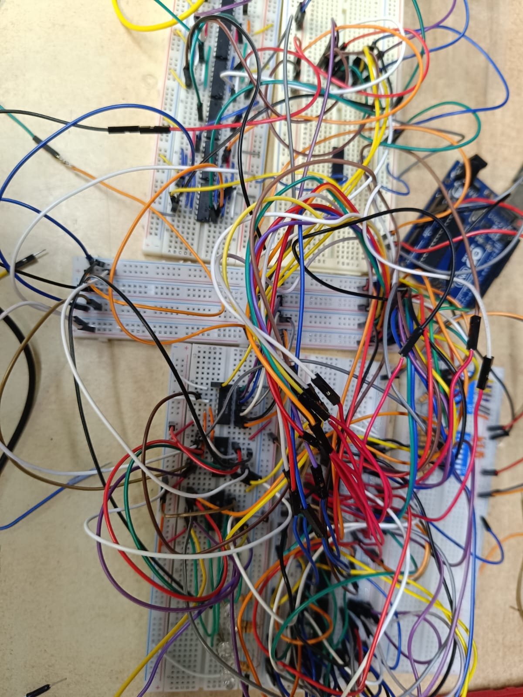
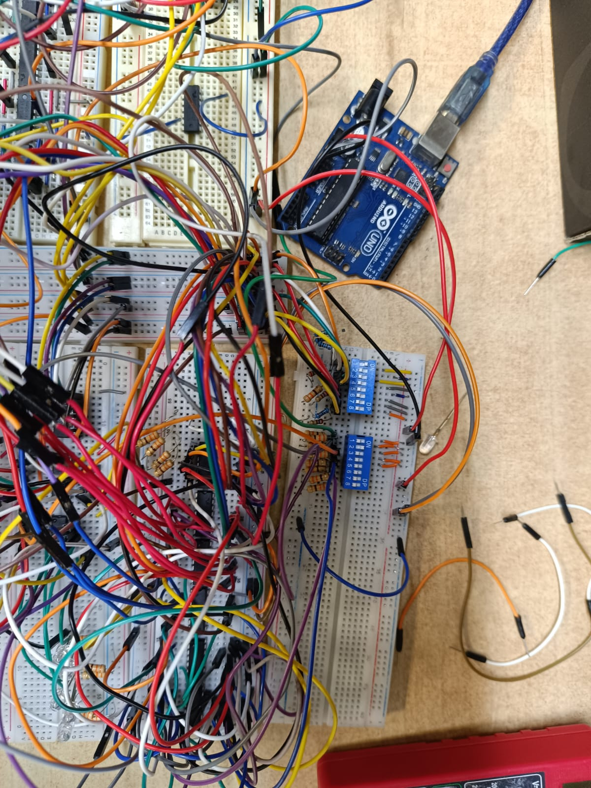
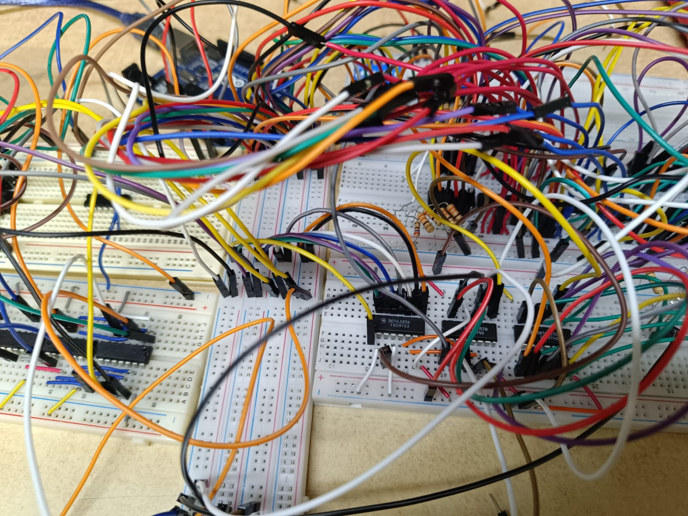
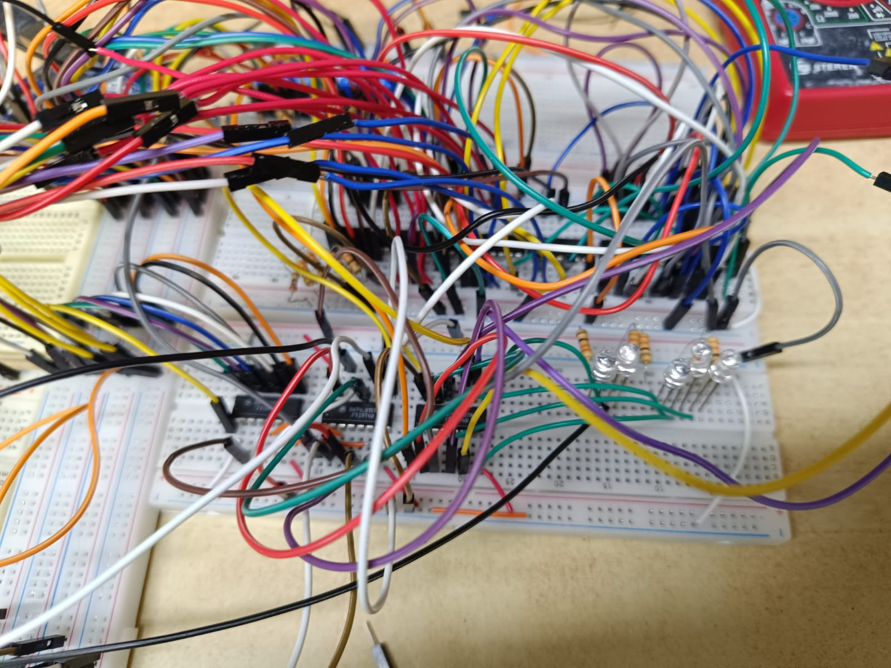

# Unidad Aritmético Lógica (ALU) de 4 bits - Tecnología TTL

Esta Unidad Aritmético Lógica (ALU) de 4 bits es un circuito digital combinacional diseñado desde cero utilizando exclusivamente compuertas lógicas discretas y multiplexores de la familia 74LS. Como bloque fundamental en la arquitectura de sistemas, este diseño modular está pensado para integrarse de manera fluida con otros componentes (como un Program Counter o registros) en la eventual construcción de un microprocesador de 4 bits.

## Características y Operaciones
El circuito procesa dos operandos de 4 bits (*nibbles*) y ejecuta operaciones seleccionables mediante señales de control configuradas vía Dip-Switches:
* **Aritméticas:** Suma y Resta.
* **Lógicas:** AND, OR, XOR, NOT.
* **Comparación:** Igualdad (A == B), Mayor que (A > B), Menor que (A < B).

## Arquitectura del Sistema
El ruteo de datos y la selección de operaciones se gestiona mediante una arquitectura basada fuertemente en multiplexores.

### 1. Unidad Aritmética (Sumador / Restador)
La suma se realiza mediante una cascada de 4 *Full Adders*. Cada uno fue construido lógicamente utilizando compuertas XOR (74LS86), AND (74LS08) y OR (74LS32).
Para lograr la resta, se implementó el método de complemento a 2: se invierte la entrada B utilizando compuertas XOR (que actúan como NOT al recibir un 1 lógico en una de sus patas) y se suma 1 a través del *Carry-In* inicial del primer sumador[cite: 241, 243, 245].

### 2. Unidad Lógica y Control
Las operaciones bit a bit se ejecutan de manera concurrente. La selección del resultado lógico se realiza mediante multiplexores 74LS153 (Mux de 4 a 1)
Para la etapa final de salida, dos multiplexores 74LS157 (Mux de 2 a 1) aíslan y deciden si los LEDs mostrarán el resultado de la ruta aritmética/comparación o el de la ruta lógica.

### 3. Comparador
Las comparaciones de magnitud se delegaron al circuito integrado 74LS85, evaluando directamente las entradas A y B[cite: 98, 287].

## Lista de Materiales (BOM) Hardware
Para la prueba de concepto física se requirió la orquestación del siguiente hardware sobre 4 protoboards:
* **Lógica Combinacional básica:** 4x 74LS86 (XOR), 3x 74LS32 (OR), 3x 74LS08 (AND), 1x 74LS04 (NOT).
* **Enrutamiento de señales:** 2x 74LS157, 2x 74LS153.
* **Comparación:** 1x 74LS85.
* **I/O:** 2 Dip-Switches (datos y *opcodes*), 5 LEDs indicadores (4 bits + 1 *Carry-Out*) y resistores de 300 ohms.

## Simulación Digital
El diseño lógico fue rigurosamente diseñado y validado antes de pasar al cobre. En este repositorio se incluye el archivo fuente `ALU.circ` compatible con **Logisim-Evolution**, donde se puede explorar interactivamente el comportamiento del circuito combinacional completo.

## Implementación Física: Retos y Aprendizajes
*(Nota: Inserta aquí 2 o 3 de tus mejores fotografías del circuito armado).*

La transición del entorno ideal de simulación a la implementación física con tecnología TTL demostró ser un desafío de ingeniería invaluable. Dada la alta densidad de cableado requerida para interconectar los múltiples integrados en paralelo[cite: 256], este prototipo funcionó como una comprobación empírica extrema. 

El montaje físico permitió validar la lógica matemática frente a condiciones del mundo real, enfrentando problemas de ruteo físico de las señales de acarreo (*carry propagation*) y aislando la ruta de datos, un paso crucial de depuración antes de escalar este módulo hacia una PCB o integrarlo al bus de datos de un procesador mayor.

## Implementacion Física: Retos y Aprendizajes

La transición del entorno ideal de simulación a la implementación física con tecnología TTL demostró ser un desafío de ingeniería invaluable. Dada la alta densidad de cableado requerida para interconectar los múltiples integrados en paralelo, este prototipo funcionó como una comprobación empírica extrema. 

*(Agrega aquí tu foto general de las placas, como la foto 2 o 3)*

El montaje se dividió en tres etapas principales sobre 4 protoboards:

1. **Etapa de Entrada y Control:** Operandos y Opcodes se ingresan mediante dos módulos Dip-Switch. (Nota: Se utilizó un Arduino Uno de manera auxiliar exclusivamente como fuente regulada de 5V para alimentar los buses lógicos).
*(Agrega aquí la foto 1, donde se ve el Arduino y los Dip-switches)*

2. **Núcleo Lógico y Comparador:** El ruteo físico de las señales de acarreo (*carry propagation*) entre los 74LS86, 74LS08 y 74LS32 requirió un manejo cuidadoso para evitar diafonía o ruido que afectara los multiplexores y el comparador de magnitud 74LS85.
*(Agrega aquí la foto 4, donde se lee el SN74LS85N)*

3. **Etapa de Salida:** Aislamiento de las señales resultantes hacia un arreglo de 5 LEDs (4 bits de resultado + 1 bit de Carry-Out / Signo).
*(Agrega aquí la foto 5, donde se ven los LEDs prendidos/apagados)*

Este montaje físico validó la lógica matemática frente a condiciones del mundo real, un paso crucial de depuración antes de escalar este módulo hacia un circuito impreso (PCB) o integrarlo al bus de datos de un procesador mayor.
